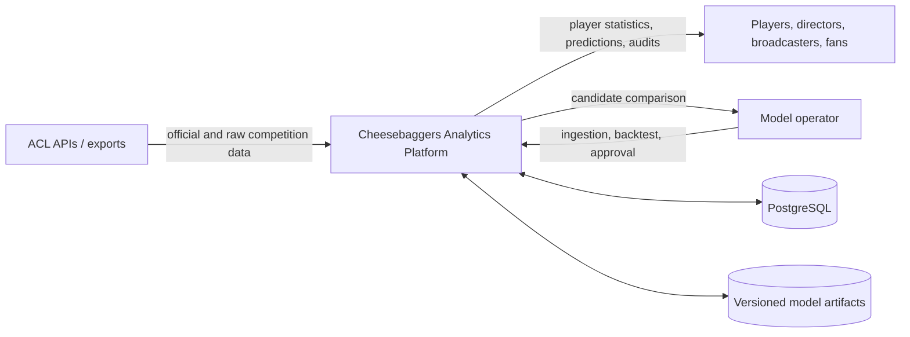
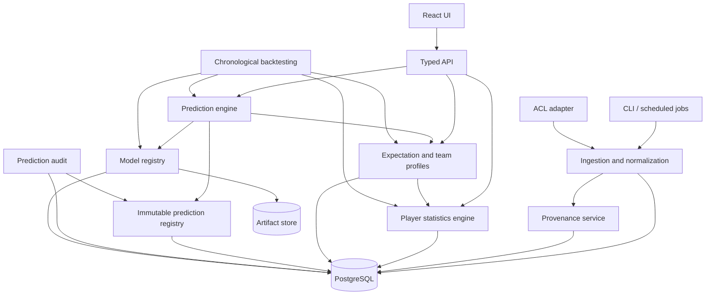
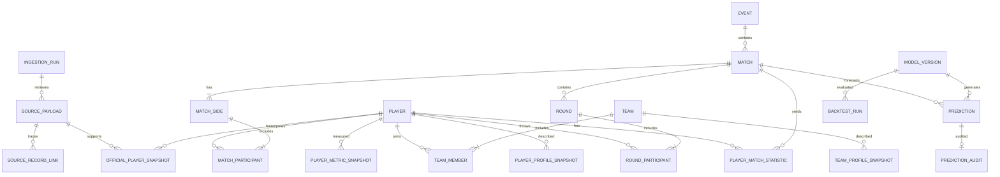

# Cheesebaggers Analytics Platform: Phase 0 Architecture Proposal

Status: **Proposed — review required before implementation**

The completed ACL data audit and resulting prediction-engine constraints are consolidated in
[`prediction-engine-data-review-strategy.md`](./prediction-engine-data-review-strategy.md).
That decision record governs source eligibility, historical cutoffs, missing-data handling,
and the staged model rollout.

This proposal translates the kickoff specifications into an implementation plan for the
existing Cheesebaggers repository. It does not authorize or contain Phase 0 application
implementation.

## 1. Proposed technology stack

### Application

- Python 3.12
- FastAPI for typed HTTP APIs and generated OpenAPI documentation
- Pydantic v2 for boundary validation and explicit nullable fields
- SQLAlchemy 2 for persistence interfaces and transactions
- Alembic for forward-only database migrations
- PostgreSQL 16 as the system of record
- Psycopg 3 as the PostgreSQL driver
- Existing React, TypeScript, and Vite frontend, migrated incrementally to generated API
  types

### Analytics and modeling

- Polars for deterministic tabular feature calculations
- NumPy and scikit-learn for rules benchmarks and logistic regression
- LightGBM or XGBoost only when Phase 8 begins, selected by an ADR and chronological
  evaluation
- Joblib plus database metadata for model artifacts and the model registry

### Quality and operations

- pytest, pytest-cov, Hypothesis, and Testcontainers
- Ruff for linting and formatting; mypy in strict mode for application modules
- npm scripts plus TypeScript compiler and ESLint for the frontend
- Structured JSON logging with request, ingestion-run, model-version, and prediction IDs
- Docker Compose for local PostgreSQL
- GitHub Actions for lint, unit tests, integration tests, migration checks, frontend build,
  and leakage tests

### Why this stack

The repository is already Python and React. A Python modular monolith avoids premature
distributed-system complexity while retaining clear service boundaries that can later be
split. PostgreSQL provides transactional normalization, JSONB raw-payload retention,
constraints, and temporal querying. FastAPI and Pydantic add typed interfaces without
requiring a language rewrite.

The current Flask application remains available during migration. New endpoints are built
in the typed application and traffic is moved by capability, not by a single large rewrite.

## 2. Proposed repository structure

```text
backend/
  legacy/                       # current Flask prototype during migration
  src/cheesebaggers/
    api/                        # HTTP routes and API schemas
    config/                     # typed environment configuration
    domain/
      ingestion/
      players/
      competition/              # events, matches, sides, rounds
      metrics/
      profiles/
      predictions/
      audits/
      backtesting/
      models/
    application/                # use cases and transaction orchestration
    infrastructure/
      acl/                      # ACL adapters only
      db/                       # SQLAlchemy mappings and repositories
      artifacts/                # model artifact storage adapter
      logging/
    main.py
  migrations/
  tests/
    unit/
    integration/
    contract/
    leakage/
    fixtures/
frontend/
  src/
    api/
    components/
    features/
      players/
      predictions/
      audits/
      models/
    pages/
docs/
  adr/
  architecture/
  data-dictionary/
  metrics/
scripts/
  dev/
  ingestion/
```

Domain modules may depend on shared domain primitives, but not on API, SQLAlchemy, ACL, or
frontend code. Infrastructure implements ports owned by the domain/application layer.

## 3. System-context diagram



ACL is authoritative for values explicitly supplied by ACL, but—except for CPI—an ACL
statistic may coexist with a separately calculated Cheesebaggers version of the same
concept. The two values are preserved and displayed side-by-side with source, scope,
window, retrieval time, and calculation metadata. The platform never calculates or infers
official CPI.

## 4. Component diagram



All analytics reads accept an explicit `data_cutoff_at`. Production prediction creation and
historical replay call the same calculation code.

## 5. Initial entity-relationship diagram



Important refinements to the conceptual kickoff schema:

- External identity is stored in an `external_identifiers` relation keyed by
  `(source_system, entity_type, external_id)`. An ACL player ID can therefore equal an ACL
  event or match ID without collision.
- Events, matches, rounds, and every normalized record are linked to one or more raw
  payloads through `source_record_links`; a single `source_payload_id` column is
  insufficient when later payloads corroborate or update a record.
- A match has two explicit sides. Each side has one participant for singles or two for
  doubles. Teams/partnerships are reusable historical entities, not encoded into player
  columns.
- Missing values remain nullable and are accompanied by availability/quality metadata
  where absence and zero could otherwise be confused.
- `throw_order_status` is an enum (`UNKNOWN`, `SOURCE_REPORTED`, `DERIVED_FROM_HISTORY`).
  The evidence record and algorithm version are stored when it is derived.
- Official snapshots and calculated metric/profile snapshots are separate relations.
- Source-reported statistics such as ACL season PPR are stored as immutable observations.
  Cheesebaggers may independently calculate season PPR from retained match data, but that
  result is a distinct calculated observation and never overwrites or impersonates the ACL
  value.
- Statistic comparisons store the two observation references, numeric delta, relative
  delta, coverage information, and an evidence-based reconciliation status. They do not
  manufacture a definitive explanation for discrepancies.
- Predictions are append-only and retain canonical feature JSON plus an immutable hash.

## 6. Migration strategy

1. Establish Alembic with an empty baseline and PostgreSQL extension prerequisites.
2. Add source identity, ingestion runs, raw payloads, hashes, and provenance links.
3. Add players and official snapshots. Do not import any field as CPI unless the adapter
   maps an explicit ACL CPI field.
4. Add events, matches, sides, participants, teams, team members, rounds, and round
   participants.
5. Import a small representative fixture set, then the retained local ACL payload corpus.
6. Reconcile counts and hashes against the current file-based data before switching reads.
7. Add metric, profile, model, prediction, and audit tables in their owning phases.
8. Move API reads one endpoint at a time; keep a rollback path to the existing Flask/file
   implementation until reconciliation passes.

Migrations are forward-only in shared environments. Destructive or lossy schema changes use
expand/migrate/contract: add the new representation, backfill and verify, switch readers,
then remove the old representation in a later release. Data backfills are resumable,
idempotent jobs with an ingestion-run record, not opaque migration-side network calls.

## 7. Data-ingestion architecture

An `AclAdapter` port returns a validated source envelope:

```text
source system, endpoint/resource kind, entity type, external ID,
retrieved_at, source_as_of (when supplied), HTTP metadata, raw bytes/JSON
```

The pipeline is:

1. Fetch without transforming.
2. Canonicalize JSON only for hashing; preserve the original body and metadata.
3. Compute SHA-256 over canonical content and enforce a deduplication key scoped by source,
   resource kind, and payload hash.
4. Persist the raw payload before normalization.
5. Validate the adapter contract. Schema drift produces a quarantined payload and explicit
   failure, never silent field loss.
6. Normalize in a transaction using external identity keys and deterministic upserts.
7. Create field/record provenance links with normalization version and `as_of`.
8. Emit completeness and data-quality results.

The mock ACL adapter reads version-controlled singles and doubles fixtures. Production ACL
transport, authentication, retry policy, and rate limiting remain isolated from
normalization. Reprocessing a payload never requires another network request.

Normalization is idempotent for the same payload. A later payload may add newly available
facts, but it must not replace history. Conflicting official observations create a new
snapshot or a data-quality exception according to entity rules.

### Reported and calculated statistics

Statistics use a common observation envelope while retaining separate source
classifications:

- `ACL_OFFICIAL`: a value reported by ACL, including CPI and ACL-computed statistics such
  as season PPR;
- `CHEESEBAGGERS_CALCULATED`: a value independently calculated from the platform's retained
  facts;
- `CHEESEBAGGERS_PREDICTED`;
- `USER_ENTERED`.

Every observation records its metric key, entity, value, unit, scope, window start/end,
`as_of`, sample size when known, source payload or input manifest, and definition/version
when applicable. “Official” identifies provenance; it does not imply that an ACL-reported
PPR and an internally calculated PPR used identical inputs, filters, late corrections, or
round inclusion rules.

The comparison service may report:

- the exact absolute and relative difference;
- known coverage differences, such as matches present in one input set but not the other;
- known scope or time-window differences;
- definition/version differences when documented;
- data-quality warnings and missingness;
- a list of plausible contributing factors explicitly labeled as hypotheses.

It must report `UNEXPLAINED` when the available evidence cannot establish a cause. Language
such as “may differ because…” is allowed; language claiming a cause is allowed only when
the relevant source records or documented definitions prove it. Neither value is silently
selected as the “correct” one.

## 8. Testing strategy

### Unit

- Domain entities, enums, and invariants
- Payload canonicalization and hashes
- Adapter-to-canonical mappings
- Singles and doubles normalization
- Throw-order state transitions, including washes and unknown order
- Deterministic metrics using frozen clocks and exact fixtures
- Probability, confidence, and source-classification invariants

### Integration

- Repository behavior against real PostgreSQL via Testcontainers
- Alembic upgrade from an empty database and from each supported prior revision
- Transaction rollback and idempotent replay
- Provenance from every normalized fixture record to raw payload
- Historical official snapshots without CPI inference
- Side-by-side ACL-reported and Cheesebaggers-calculated PPR observations without overwrite
- Discrepancy reports that distinguish proven causes, possible factors, and unexplained
  differences
- Immutable prediction enforcement at both repository and database levels

### Contract and regression

- Saved ACL payload contracts detect upstream schema drift
- API OpenAPI snapshots and generated frontend types
- Golden metric/profile/prediction fixtures keyed by calculation version
- Current prototype response comparisons during endpoint migration

### Property and leakage

- Probabilities remain in `[0, 1]` and opposing probabilities sum to one
- Reordering equivalent input does not change canonical hashes or calculations
- Re-ingestion does not increase normalized row counts
- Perturbing any source record after a cutoff cannot alter a prediction at that cutoff

CI runs fast unit checks on every change and PostgreSQL/integration/leakage suites before
merge. Model promotion additionally requires the full chronological evaluation suite and
operator approval.

## 9. Backtesting leakage-prevention strategy

- Every observation has `observed_at`, `effective_at` when supplied, `retrieved_at`, and a
  source classification. Every derived snapshot has `as_of` and calculation version.
- Feature repositories require a `data_cutoff_at`; they expose no unbounded “latest” method
  to prediction or backtest code.
- An observation is eligible only if it was known by the cutoff. Event completion fields,
  winner, scores, audits, and payloads retrieved after the cutoff are denied.
- Backtests process matches in stable chronological order using scheduled/start time plus a
  deterministic tie breaker. Same-time matches do not see each other's outcomes unless a
  documented event rule proves availability.
- Splits are chronological. Preprocessing, imputation, calibration, feature selection, and
  hyperparameter fitting occur inside each training fold.
- The final test period is immutable to candidate fitting and selection.
- Each prediction stores the cutoff, selected profile/metric versions, full canonical
  feature snapshot, source manifest, model version, and hash.
- “Time travel” tests insert high-impact future rows and assert earlier features and
  predictions remain byte-for-byte identical.
- Champion promotion is an explicit operator action; evaluation never updates production
  status automatically.

## 10. Phase-one implementation plan

### Phase 0 — foundation, after approval

1. Record approved ADRs and move the current Flask modules under a documented legacy
   boundary without changing behavior.
2. Add the typed backend package, configuration, logging, linting, tests, CI, PostgreSQL,
   SQLAlchemy, and Alembic.
3. Add architecture fitness tests for dependency direction.

### Phase 1A — provenance core

1. Implement ingestion runs, source payload persistence, canonical hashing, external
   identities, provenance links, and quarantine/error records.
2. Implement adapter interfaces and a mock ACL adapter.
3. Verify deduplication, replay, and schema-drift behavior.

### Phase 1B — competition model

1. Implement players, official player snapshots, events, matches, sides, participants,
   teams/partnerships, rounds, and round participants.
2. Normalize singles and doubles fixtures idempotently.
3. Implement explicit missingness and conservative throw-order state/evidence.

### Phase 1C — current-data import and reconciliation

1. Inventory the existing local JSON shapes and classify payload resource kinds.
2. Import a representative subset, then the corpus through the same adapter boundary.
3. Produce completeness, rejected-payload, identity-collision, and source-traceability
   reports.
4. Document local setup, migration, ingestion, replay, and test commands.

### Phase 1 definition of done

- All applicable data acceptance criteria pass.
- Singles and doubles fixtures have complete raw-to-normalized provenance.
- Replaying fixtures is idempotent.
- Official CPI history is stored only when present in an ACL official source.
- ACL-reported non-CPI statistics and independently calculated equivalents remain distinct,
  queryable observations.
- Differences between equivalent statistics are quantified without an unsupported causal
  conclusion.
- Unknown fields and throw order remain explicitly unknown.
- The current prototype has not been broken or silently switched to incomplete data.

Metrics, profiles, prediction generation, audits, and backtesting are intentionally later
phases, although Phase 1 schemas and temporal conventions keep those phases possible.

## 11. Ambiguities and ADRs needed

The following decisions should be reviewed before Phase 0 implementation:

| ADR | Proposed decision | Why a decision is required |
|---|---|---|
| ADR-001 | Python modular monolith with FastAPI; incrementally retire Flask | The supplied architecture defines boundaries but not deployment topology or web framework. |
| ADR-002 | PostgreSQL 16; UUIDv7 internal IDs and scoped external-identity relation | The conceptual schema assumes UUIDs and globally unique external match/player IDs without defining ID generation or source scope. |
| ADR-003 | Raw payloads stored in PostgreSQL JSONB initially, behind a payload-store port | Long-term payload volume and retention tier are unspecified. |
| ADR-004 | SHA-256 of RFC 8785-style canonical JSON for semantic deduplication; retain original body separately | “Hash payloads” does not define canonicalization or whether transport-level differences count as duplicates. |
| ADR-005 | Four timestamps: source effective, source observed, retrieved, and system recorded | `as_of`, effective time, and late-arriving data semantics are not fully defined. |
| ADR-006 | Match sides plus participant memberships support singles/doubles; partnership identity is unordered unless source roles are explicit | Team persistence, substitutions, and player ordering are unspecified. |
| ADR-007 | Throw order stays unknown unless source-reported or deterministically derived with stored evidence and algorithm version | The exact ACL scoring-history rule and behavior after missing rounds are unspecified. |
| ADR-008 | Append official observations; never copy calculated values into official columns | Whether identical CPI observations should create repeated snapshots needs a retention rule. |
| ADR-009 | Append-only predictions protected by database triggers/permissions; audits are separate append-once records with correction history | “Immutable” does not define operational correction procedures. |
| ADR-010 | UTC storage; source timezone retained; match ordering uses scheduled/start time and stable internal ID | Event timezone and simultaneous-match ordering are unspecified. |
| ADR-011 | Missing numerical features remain null with availability indicators; model-specific imputation is fitted and versioned | The specifications prohibit silent imputation but do not define prediction fallbacks. |
| ADR-012 | Model artifacts stored through a content-addressed port; metadata and approval state live in PostgreSQL | Artifact storage location and promotion authorization are unspecified. |
| ADR-013 | Preserve ACL-reported and Cheesebaggers-calculated versions of non-CPI statistics side-by-side; reconciliation records separate proven causes, hypotheses, and unexplained differences | “Official” provenance does not guarantee identical definitions or source coverage, and the system must not overwrite either value or claim certainty it cannot support. |

### Product/domain clarifications still needed

- Which ACL endpoint/field is the authoritative official CPI source, and can CPI be scoped
  by season, division, format, or membership?
- Which ACL statistics besides CPI are reported, what are their documented definitions and
  time-window rules, and does ACL expose the underlying match/round inclusion set?
- Are “round” and ACL “frame” always equivalent, and can a match contain multiple games or
  bracket resets that require a game entity?
- Is a doubles partnership an unordered pair, or do side/throwing roles make ordered
  partnership identities meaningful?
- What source evidence is sufficient to infer the first thrower after incomplete history?
- What is the official match-time fallback order when scheduled, started, and completed
  timestamps are missing?
- What retention and privacy requirements apply to player profiles and raw ACL payloads?
- Which deployment target and model-artifact backing store should Phase 0 support?

Until answered, implementation should follow the conservative proposals above and record
each accepted assumption in an ADR.

The proposed unauthenticated collection and reconciliation approach is documented in
[`../player-stats-without-authenticated-profile.md`](../player-stats-without-authenticated-profile.md).

## Review checkpoint

Approval of this proposal authorizes Phase 0 only. Phase 1 begins after Phase 0 tooling,
migrations, and architecture tests pass. Any requested changes should be incorporated here
and reflected in the corresponding ADR before implementation.
